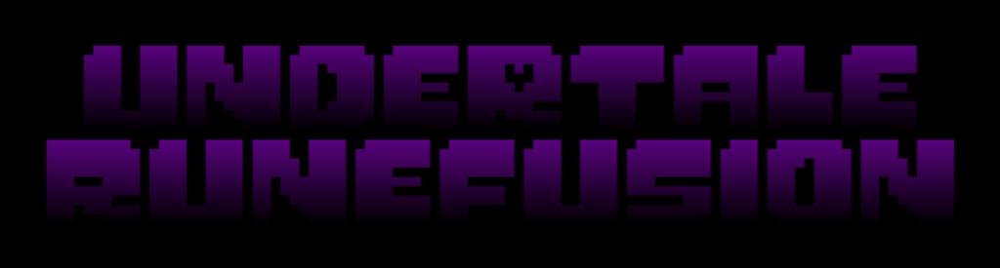

# Undertale-RuneFusion



> **An Undertale engine built entirely in Unity.**  
> Designed for *porting, modding, and creating* your own Undertale-style games with gameplay, UI, and charm.

---

## Overview
**Undertale-RuneFusion** is a Unity-based engine that recreates the core mechanics of **Undertale** — including:
- Accurate **movement** with sprite animations.
- Scene-based **room transitions** with spawn markers.
- In-game **menu system** with SOUL navigation, item usage, and stats.
- Authentic **UI layout**, **SFX**, and **game flow** Recreated just like in Undertale.
- 100% editable in the Unity Editor, making it User-friendly and easy for fans and developers to build custom content.

---

## Features (Work In Progress)
✅ Smooth Player Movement  
✅ Scene Transition System  
✅ Fade-in/out transitions  
✅ Full UI Menu  
🔲 Battle Engine (coming soon!)  
🔲 Dialogue System with Text Flow  
🔲 Save Points and Persistence  
🔲 Wiki and Video tutorial  

---

## Requirements
- **Unity 6000.2.6f1** (use this exact editor version for guaranteed compatibility)  
- **Git** (for version control and cloning)  
- Optional: **VS Code** or **Rider** for script editing

> *Note:* This project has been developed and tested with Unity **6000.2.6f1**. Using a different Unity editor version may cause API/serialization differences.

---

## Getting Started

### Clone the repository
```bash
git clone https://github.com/Chullo2010/Undertale-RuneFusion.git
cd Undertale-RuneFusion
